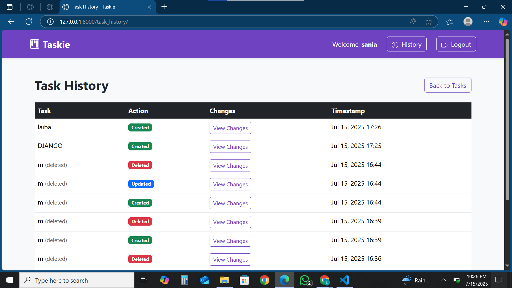

<h1 align="center">🧠 Taskie - Smart Task Manager</h1>

<p align="center">
  A beautiful, Dockerized Django-based task management system with full task lifecycle, history tracking, Swagger API support, and user authentication.
</p>

<div align="center">
  
  
  
  
</div>

---

## ✨ Key Features

- 🔐 User Authentication (Signup/Login)
- 📋 Task CRUD (Create, Read, Update, Delete)
- ⛓ Task Dependencies
- 🔄 Statuses: Pending | In Progress | Completed
- 🕓 Task History Log (Created / Updated / Deleted)
- 🔍 Task Search in History
- 🌐 Swagger UI (API Docs via `drf-yasg`)
- 🐳 Fully Dockerized Environment

---

## 🖼️ UI Preview

> Add your screenshots in the `screenshots/` folder.

<table>
  <tr>
    <td></td>
    <td></td>
  </tr>
  <tr>
    <td align="center">Dashboard View</td>
    <td align="center">Task History</td>
  </tr>
</table>

---

## 🛠 Tech Stack

| Layer       | Technology              |
|-------------|--------------------------|
| Backend     | Django 4.x, DRF          |
| Database    | SQLite (default)         |
| API Docs    | Swagger (drf-yasg)       |
| Frontend    | HTML, Bootstrap 5        |
| DevOps      | Docker + Docker Compose  |

---

## 🚀 Getting Started

### 1️⃣ Clone the Repository

```bash
git clone https://github.com/Laiba-muzammal/taskie.git
cd taskie
````

### 2️⃣ Run with Docker

```bash
docker-compose up --build
```

Then open:

* 🌐 App: [http://localhost:8000](http://localhost:8000)
* 📘 Swagger: [http://localhost:8000/api/docs/](http://localhost:8000/api/docs/)

---

## 🔌 API Access (via Swagger)

Explore and test endpoints like:

* `GET /api/tasks/`
* `POST /api/tasks/`
* `PUT /api/tasks/{id}/`
* `DELETE /api/tasks/{id}/`

➡️ Visit `/api/docs/` for full interactive documentation.

---

## 📁 Project Structure

```
taskie/
├── tasks/              # Core app with models/views
├── api/                # DRF views and serializers
├── templates/          # HTML pages
├── static/             # CSS / JS / assets
├── Dockerfile
├── docker-compose.yml
└── README.md
```

---

## 🎬 Optional: Add Demo Video

Place demo video in `/demo/` and embed like this:

```html
<video controls width="100%">
  <source src="demo/taskie_demo.mp4" type="video/mp4">
</video>
```

---

## 📄 License

MIT License © [Laiba Muzammal](https://github.com/Laiba-muzammal)

---

> Built with 💙 for learning, personal productivity, and resume building.


